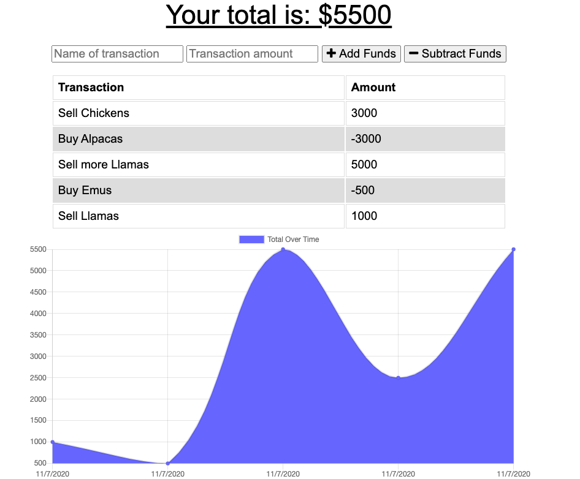

# budget-tracker
     [](https://api.github.com/licenses/mit)



(https://aqueous-escarpment-07668.herokuapp.com/)

Table Of Contents:

- [Section 1: Introduction](#introduction)
- [Section 2: Installation](#installation)
- [Section 3: Usage](#usage)
- [Section 4: License](#license)
- [Section 5: Credits](#credits)

## Introduction:

This is a smimple PWA enabled budget tracking application that can be used on or offline for logging deposits and debits. It will add your offline transactions to the database once the application returns online.

## Installation:

You can use this application in browser, and also download it to your desktop or homescreen as a PWA. From there it can be run either on or offline.

To work on the code or run this locally, download the files from the GitHub repository, run 
```
npm install 
```

## Usage
Online: access the application here: 

To run locally, run 
```
npm start
```
and navigate to the localhost port displayed

you can view a live demo here: [Deployed App](https://aqueous-escarpment-07668.herokuapp.com/)

## License
* MIT (LICENSE)

## Contributing
To contribute open a pull request. 

## Questions
* Contact [n-lambert](https://github.com/n-lambert)